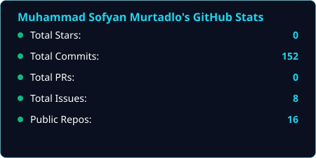
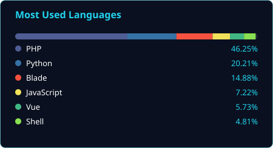

<!--
  Portrait banner (Phase 1) skipped — no photo was provided.
  Once you have a head-and-shoulders photo on a plain background, ask to build it
  and I'll generate dark.svg / light.svg via the Python dithering pipeline, then
  you can add a <picture> block here above the stats section.
-->

### Muhammad Sofyan Murtadlo
Full-Stack Developer · Building + Learning + Shipping

<!--
  PHASE 2 — Stats cards
  Static SVGs baked into assets/, generated from live GitHub API data
  (no external rate-limited service involved, so this never 503s).
  Re-run the generator script (kept alongside the source .json data,
  not just the SVG) whenever you want the numbers refreshed.
-->

<table><tr>
<td width="50%"></td>
<td width="50%"></td>
</tr></table>

<!-- PHASE 3 — Contribution snake -->
<picture>
  <source media="(prefers-color-scheme: dark)" srcset="https://raw.githubusercontent.com/msofyanmurtadlo/msofyanmurtadlo/output/github-snake-dark.svg" />
  <source media="(prefers-color-scheme: light)" srcset="https://raw.githubusercontent.com/msofyanmurtadlo/msofyanmurtadlo/output/github-snake.svg" />
  
</picture>

<!-- PHASE 4 — Social badges -->
<!-- Replace each href with your real profile URL/address before publishing -->
&nbsp;&nbsp;
&nbsp;&nbsp;
&nbsp;&nbsp;
&nbsp;&nbsp;

<!--
  Note: LinkedIn's shields.io logo only renders on brand blue (#0A66C2).
  Left it on brand blue above on purpose — recoloring it to 0A101F would make
  the glyph silently disappear, leaving just text.
-->
